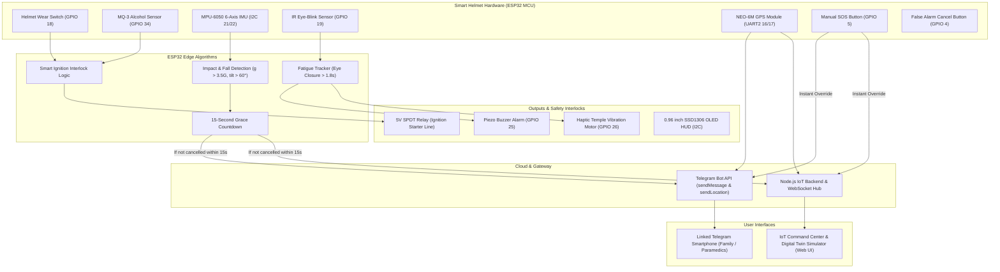

# 🏍️ SafeRider IoT: Smart Helmet with Emergency Alert System

> **An Autonomous Edge-IoT Safety Ecosystem: Alcohol Interlock, Drowsiness Wake-Up, Crash Impact Detection, and Automated Emergency Telegram Dispatch with Live GPS Navigation.**

[](https://www.espressif.com/)
[](https://nodejs.org)
[](https://core.telegram.org/bots/api)
[](https://leafletjs.com)
[](https://developer.mozilla.org/en-US/docs/Web/API/WebSockets_API)

---

## 1. System Architecture Overview



---

## 2. Key Features

### 🛡️ 1. Alcohol Detection & Ignition Interlock
- Continuous breath sampling using **MQ-3 Gas Sensor**.
- If Blood Alcohol Concentration (BAC) exceeds **350 PPM**:
  - Bike Starter Relay is immediately opened/locked (**Engine Cannot Start**).
  - High-decibel audio warning buzzer sounds.
  - OLED and Dashboard display `"ALCOHOL DETECTED — IGNITION LOCKED"`.

### 😴 2. Drowsiness & Fatigue Monitoring
- Dual-modal detection via **IR Eye-Blink Sensor** and head nod detection.
- Detects prolonged eye closure (> 1.8 seconds) indicative of micro-sleep.
- Instantly activates a **high-frequency buzzer alarm** and **temple haptic vibration motor** to immediately wake the rider.
- Audio announcement via Web Audio API: *"Wake up! Drowsiness detected. Please pull over safely."*

### 💥 3. Accident & Crash Detection
- **MPU-6050 6-Axis Accelerometer & Gyroscope** measures impact G-forces and bike tilt/roll.
- Triggers when G-force exceeds **3.5G** combined with roll/pitch tilt **> 60°**.
- Initiates an autonomous **15-Second Grace Countdown** with loud pulsing siren.

### 🛑 4. False Alarm Cancellation
- If the rider simply dropped their helmet or had a minor bump and is safe:
- Rider presses the physical **"I AM OK"** button (or UI button) within the 15-second window.
- The emergency alert is cleanly aborted with no false emergency dispatches.

### 📲 5. Emergency SOS with Live GPS to Linked Telegram
- If the 15-second countdown reaches zero (or if rider presses **Manual SOS**):
  - Automatically fetches live GPS latitude, longitude, altitude, and speed from **NEO-6M GPS Module**.
  - Sends a rich, formatted **Telegram Emergency Alert**:
    - Detailed impact metrics (G-force, tilt angle, speed, BAC).
    - Rider identification, blood group, vehicle ID.
    - Clickable Google Maps link: `https://www.google.com/maps?q={lat},{lng}`.
  - Sends a **Native Telegram Interactive Location Pin** (`sendLocation`) for 1-tap turn-by-turn navigation by emergency responders.

### 🪖 6. Helmet Wear Compliance
- Helmet wear contact switch ensures the bike cannot be started without the helmet securely buckled on the head.

### 💻 7. Futuristic Digital Twin Command Center & Hardware Simulator
- **Live Leaflet GPS Map**: Real-time motorcycle tracking on dark-mode maps with breadcrumb trails and pulsing accident beacon.
- **Digital Twin Helmet HUD**: Interactive SVG helmet showing real-time sensor readings and tilt horizon.
- **Hardware Simulator Console**: Interactive sliders and buttons to simulate alcohol inhalation, micro-sleep, bumps, and severe crashes.
- **Real-time Telemetry Graphs**: Rolling multi-axis Chart.js graphs for G-Force, Alcohol PPM, and Speed.
- **Black Box Incident Logger**: Complete chronological audit log of all events with JSON/CSV export.

---

## 3. Quick Start: Running the IoT Dashboard & Simulator

### Prerequisites
- Node.js (v18 or v20+)
- Any modern web browser (Chrome, Firefox, Safari, Edge)

### Launch in 1 Step:
```bash
# Navigate to project directory
cd /home/charanvudugula1996/ai-lms/iot-smart-helmet

# Make launcher executable and run
chmod +x start.sh
./start.sh
```

Or run directly with npm:
```bash
cd /home/charanvudugula1996/ai-lms/iot-smart-helmet/backend
npm start
```

Open your browser to:
👉 **`http://localhost:5000`**

---

## 4. How to Link Your Telegram Account (60 Seconds)

You can receive real accident alerts and live Google Maps locations directly on your smartphone:

1. **Create a Free Bot with @BotFather**:
   - Open Telegram on your phone or computer and search for `@BotFather`.
   - Send `/newbot`, name your bot (e.g. `MySmartHelmetBot`), and get your **Bot Token** (looks like `7123456789:AAHk_...`).
2. **Find Your Chat ID**:
   - Search for `@userinfobot` on Telegram and click **Start**.
   - Copy the numeric **Id** (e.g. `123456789`).
   - *Alternative:* Open your newly created bot and click **Start**.
3. **Configure in the Dashboard**:
   - Open the **Telegram Emergency Bot Dispatcher** panel on `http://localhost:5000`.
   - Paste your **Bot Token** and **Chat ID**.
   - Click **Save Configuration**, then click **Send Test Alert to Telegram**.
   - Your phone will instantly receive a test message and interactive GPS pin!

---

## 5. Hardware Deployment (ESP32 / Arduino)

### Pin Mapping Table (ESP32 DevKit V1)

| Module / Sensor | Sensor Pin | ESP32 GPIO | Description |
| :--- | :--- | :--- | :--- |
| **MQ-3 Alcohol Sensor** | `AOUT` | **GPIO 34** | Analog breath alcohol input |
| **Helmet Wear Switch** | Signal | **GPIO 18** | Push switch (INPUT_PULLUP) |
| **IR Eye-Blink Sensor** | `OUT` | **GPIO 19** | Digital output (LOW = eye closed) |
| **Cancel Alert Button** | Leg 1 | **GPIO 4** | "I AM OK" button (INPUT_PULLUP) |
| **Manual SOS Button** | Leg 1 | **GPIO 5** | Panic button (INPUT_PULLUP) |
| **Ignition Relay Module** | `IN` | **GPIO 23** | Starter line interlock control |
| **Piezo Buzzer** | `+` | **GPIO 25** | Acoustic alert PWM |
| **Vibration Motor** | Gate/Base | **GPIO 26** | Haptic temple wake-up motor |
| **MPU-6050 IMU** | `SDA` / `SCL` | **GPIO 21 / 22** | I2C Crash & Tilt sensor |
| **SSD1306 OLED (0.96")** | `SDA` / `SCL` | **GPIO 21 / 22** | Shared I2C bus (Address 0x3C) |
| **NEO-6M GPS Module** | `TX` / `RX` | **GPIO 16 / 17** | HardwareSerial 2 (TinyGPS++) |

### Arduino IDE Setup:
1. Open [`firmware/esp32_smart_helmet.ino`](file:///home/charanvudugula1996/ai-lms/iot-smart-helmet/firmware/esp32_smart_helmet.ino) in Arduino IDE.
2. Install required libraries:
   - `Adafruit SSD1306` & `Adafruit GFX Library`
   - `MPU6050_tockn`
   - `TinyGPSPlus`
   - `ArduinoJson`
3. Enter your WiFi SSID, Password, Telegram Bot Token, and Chat ID in lines 46-52.
4. Select board **ESP32 Dev Module** and click **Upload**!

For circuit schematics and the Bill of Materials (BOM), see [`firmware/circuit_schematic_and_bom.md`](file:///home/charanvudugula1996/ai-lms/iot-smart-helmet/firmware/circuit_schematic_and_bom.md).

---

## 6. REST API Reference

| Endpoint | Method | Payload | Description |
| :--- | :--- | :--- | :--- |
| `/api/telemetry` | `POST` | `{ alcoholPpm, gForce, roll, isHelmetWorn, ... }` | Updates live sensor state from hardware or simulator |
| `/api/telemetry/latest` | `GET` | — | Returns current helmet status & GPS position |
| `/api/alert/trigger` | `POST` | `{ type, severity, gForce, bypassGrace }` | Triggers crash countdown or immediate SOS |
| `/api/alert/cancel` | `POST` | — | Cancels active 15s countdown ("I AM OK") |
| `/api/alert/dispatch` | `POST` | `{ incidentId }` | Finalizes countdown and dispatches Telegram alert |
| `/api/telegram/config` | `POST` | `{ token, chatId, riderName, ... }` | Updates Telegram bot credentials |
| `/api/telegram/test` | `POST` | `{ token, chatId }` | Sends verification ping to phone |
| `/api/incidents` | `GET` | — | Returns Black Box incident history |
| `/ws` | `WebSocket` | — | Zero-latency 10Hz telemetry streaming |

---

## 7. License & Credits

Developed with ❤️ for rider road safety, smart mobility, and life-saving accident response.
Open-source under the MIT License.
