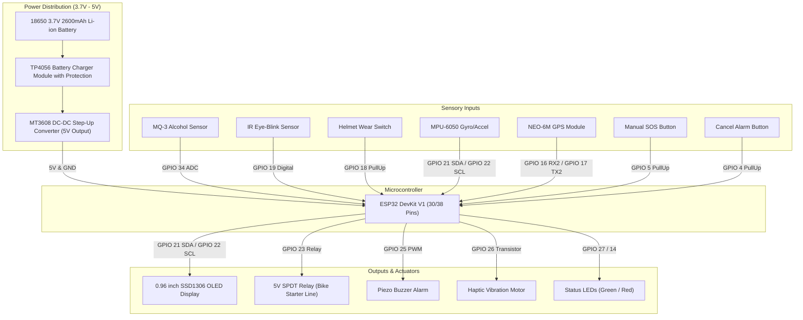

# SafeRider IoT - Hardware Circuit Schematic & Bill of Materials (BOM)

Comprehensive electrical connections, pinout specifications, and component bill of materials for the **IoT-Based Smart Helmet with Emergency Alert System**.

---

## 1. ESP32 GPIO Pinout Table

| Peripheral / Module | Sensor Pin | ESP32 GPIO Pin | Pin Type | Description |
| :--- | :--- | :--- | :--- | :--- |
| **MQ-3 Alcohol Sensor** | `AOUT` (Analog) | **GPIO 34** | ADC1_CH6 | Continuous alcohol vapor & BAC PPM reading |
| **MQ-3 Alcohol Sensor** | `DOUT` (Digital) | **GPIO 35** | Digital Input | Rapid hardware comparator threshold |
| **Helmet Wear Switch** | Signal Pin | **GPIO 18** | Input (Pull-Up) | Detects if helmet strap / crown is worn |
| **IR Eye-Blink Sensor** | `OUT` | **GPIO 19** | Digital Input | LOW when eye is closed (drowsiness detection) |
| **Emergency Cancel Btn** | Button Leg | **GPIO 4** | Input (Pull-Up) | "I AM OK" button to abort false crash alerts |
| **Manual SOS Button** | Button Leg | **GPIO 5** | Input (Pull-Up) | Instant panic trigger for immediate help |
| **Engine Ignition Relay** | `IN` | **GPIO 23** | Digital Output | Active HIGH / LOW: Cuts off bike ignition |
| **Active Piezo Buzzer** | `+` (Positive) | **GPIO 25** | PWM Output | Acoustic warning & crash grace beeps |
| **Vibration Motor** | Gate / Base | **GPIO 26** | PWM Output | Haptic wake-up alert on rider's temple/forehead |
| **Status Green LED** | Anode (`+`) | **GPIO 27** | Digital Output | System Safe & Armed indicator |
| **Alert Red LED** | Anode (`+`) | **GPIO 14** | Digital Output | Danger / Crash / Alcohol warning strobe |
| **MPU-6050 IMU** | `SDA` | **GPIO 21** | I2C Data | 6-Axis Accelerometer & Gyroscope data |
| **MPU-6050 IMU** | `SCL` | **GPIO 22** | I2C Clock | I2C Clock bus |
| **SSD1306 OLED (0.96")** | `SDA` | **GPIO 21** | I2C Data | Shared I2C bus (Address `0x3C`) |
| **SSD1306 OLED (0.96")** | `SCL` | **GPIO 22** | I2C Clock | Shared I2C clock bus |
| **NEO-6M GPS Module** | `TX` | **GPIO 16** | UART2 RX2 | Receives NMEA GPS sentences (TinyGPS++) |
| **NEO-6M GPS Module** | `RX` | **GPIO 17** | UART2 TX2 | Sends configuration commands to GPS |

---

## 2. Circuit Wiring Diagram



---

## 3. ASCII Circuit Diagram

```
                       +-------------------------------+
                       |  18650 Li-ion Battery (3.7V)  |
                       +---------------+---------------+
                                       |
                               [TP4056 Charger]
                                       |
                           [MT3608 Boost to 5V]
                                       |
     +---------------------------------+---------------------------------+
     |                                 |                                 |
     V                                 V                                 V
   [5V]                              [3.3V]                            [GND]
     |                                 |                                 |
+----+---------------------------------+---------------------------------+-----+
|                               ESP32 DevKit V1                                |
|                                                                              |
|  [GPIO 34] <--- MQ-3 Alcohol Sensor (AOUT)                                   |
|  [GPIO 19] <--- IR Eye Blink / Drowsiness Sensor (OUT)                       |
|  [GPIO 18] <--- Helmet Wear Limit/Touch Switch (NO to GND)                   |
|  [GPIO 4]  <--- False Alarm Cancel Button "I AM OK" (to GND)                 |
|  [GPIO 5]  <--- Manual SOS Panic Button (to GND)                             |
|                                                                              |
|  [GPIO 21] <===> I2C SDA: MPU-6050 (SDA) + SSD1306 OLED (SDA)                |
|  [GPIO 22] <===> I2C SCL: MPU-6050 (SCL) + SSD1306 OLED (SCL)                |
|                                                                              |
|  [GPIO 16] <--- NEO-6M GPS (TX)                                              |
|  [GPIO 17] ---> NEO-6M GPS (RX)                                              |
|                                                                              |
|  [GPIO 23] ---> Relay Module (IN) ===> Bike Ignition Ignition Coil Circuit    |
|  [GPIO 25] ---> Active Piezo Buzzer (+)                                      |
|  [GPIO 26] ---> NPN 2N2222 Transistor Base ===> Haptic Vibration Motor       |
|  [GPIO 27] ---> 220 Ohm Resistor ===> Green LED (System Ready)               |
|  [GPIO 14] ---> 220 Ohm Resistor ===> Red LED (Emergency Alert / Hazard)    |
+------------------------------------------------------------------------------+
```

---

## 4. Bill of Materials (BOM)

| Component | Specification | Quantity | Estimated Unit Cost | Function in Smart Helmet |
| :--- | :--- | :--- | :--- | :--- |
| **ESP32 DevKit V1** | Dual-core 240MHz, 4MB Flash, WiFi & BLE | 1 | $4.50 | Master processing, edge sensor fusion, Telegram & cloud IoT dispatch |
| **MQ-3 Alcohol Sensor** | Tin dioxide (SnO2) alcohol gas sensor | 1 | $2.00 | Detects rider's breath alcohol vapor |
| **MPU-6050** | 3-axis gyro + 3-axis accelerometer (I2C) | 1 | $1.80 | Impact shock (G-force) and bike tilt angle detection |
| **IR Eye-Blink Sensor** | Infrared emitter & phototransistor detector | 1 | $1.50 | Detects eye closure duration for drowsiness |
| **NEO-6M GPS Module** | Ceramic patch antenna, 50-channel receiver | 1 | $4.00 | Precise latitude, longitude, and speed tracking |
| **SSD1306 OLED** | 0.96 inch, 128x64 resolution, I2C interface | 1 | $2.50 | On-helmet visual HUD displaying status and countdown |
| **1-Channel 5V Relay** | Optocoupler isolated, 10A 250VAC / 30VDC | 1 | $0.90 | Bike engine starter interlock circuit |
| **Active Buzzer** | 5V 85dB continuous/pulse buzzer | 1 | $0.40 | Audio alarm for alcohol lock & crash countdown |
| **Vibration Motor** | 3V 1027 Coin micro vibration motor | 1 | $0.80 | Haptic temple wake-up vibration for drowsiness |
| **Micro Limit Switch** | SPDT momentary roller switch | 1 | $0.50 | Helmet buckle/strap wear confirmation |
| **Tactile Push Buttons**| 6x6mm momentary push buttons (Red & Blue) | 2 | $0.20 | Manual SOS button & False alarm cancel button |
| **18650 Li-ion Battery**| 3.7V 2600mAh rechargeable cell | 1 | $3.50 | Portable helmet power supply (12+ hours runtime) |
| **TP4056 Module** | USB-C charging board with DW01 protection | 1 | $0.60 | Safe Li-ion charging & over-discharge protection |
| **MT3608 Boost Board** | 2A Step-Up DC-DC converter (3.7V to 5V) | 1 | $0.70 | Powers 5V sensors (MQ-3, Relay, GPS) |
| **Resistors & NPN** | 220Ω (x2), 10kΩ (x2), 2N2222 transistor | 1 kit | $0.50 | LED current limiting & motor drive circuit |
| **Helmet Casing** | ABS 3D printed electronics enclosure | 1 | $5.00 | Weatherproof shock-resistant helmet mount |
| **Total Approximate Cost** | — | — | **~$28.90** | Complete high-performance smart safety system |

---

## 5. Arduino IDE Library Installation Guide

Before uploading `esp32_smart_helmet.ino`, install the following libraries via the **Arduino IDE Library Manager** (`Ctrl+Shift+I` / `Cmd+Shift+I`):

1. **Adafruit SSD1306** by Adafruit (v2.5+)
2. **Adafruit GFX Library** by Adafruit (v1.11+)
3. **MPU6050_tockn** by tockn (v1.5+)
4. **TinyGPSPlus** by Mikal Hart (v1.0.3+)
5. **ArduinoJson** by Benoît Blanchon (v6.21+)
6. **UniversalTelegramBot** (or native HTTPClient as implemented in our firmware)
